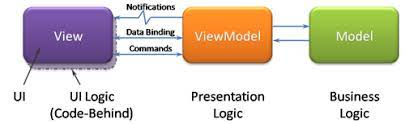

# Fleye Mobile Challenge

Repositório referente ao desafio de mobile da Fleye. O desafio pode ser encontrado aqui: https://github.com/fleye-me/fleye-flix#readme

  Foram escolhidas as tecnologias TypeScript e React Native.


# Decisões arquiteturais

  Para o pilar de *Performance*, utilizei hooks do React que possibilitam o retorno de chamadas memoizadas, tais como o [useCallback](https://react.dev/reference/react/useCallback) e o [useMemo](https://react.dev/reference/react/useMemo).
  
  Para o pilar *Maintainability* decidi estruturar a arquitetura do código seguindo o padrão arquitetural [MVVM](https://coodesh.com/blog/dicionario/o-que-e-arquitetura-mvvm/):

  

  Facilitando na reutilização e extensão de componentes, na realização de teste e também no desacoplamento de casos de uso.

  O projeto ficou separado entre as camadas de `Api`, `View`, `Model` e `Controller`.

  O `Controller` seria responsável pela comunicação entre a interface de usuário (View) e a lógica da aplicação (Model)

  A camada de `Api` consome os dados de uma [API externa](https://www.omdbapi.com/) através da biblioteca [Axios](https://axios-http.com/docs/intro). 

# Conceitos e premissas

  Em relação à arquitetura MVVM, cada uma das telas (Home, Search, Favorites e Details) possuem uma view que exibirá a interface de usuário e um controller que irá controlar a interação entre essa interface e as requisições para API.

  Uma exceção seriam as telas de Home e Search que compartilham o mesmo controller, pois atuam em conjunto na pesquisa e na listagem dos filmes.
  
  Como citado anteriormente, foi utilizada a arquitetura MVVM. Além disso, grande parte dos elementos que compõem a interface de usuário foram separados em componentes, para que sejam reutilizados no sistema, o que também facilita os testes e a manutenção da aplicação.
  
  Foram feitas duas requisições principais, passando diferentes parâmetros para a API, uma delas é responsável por listar todos os filmes como base no parâmetro de pesquisa, já a outra requisição exibe informações mais detalhadas de cada filme selecionado na listagem para que esses detalhes possam ser exibidos na tela de Details. Para essas requisições, foram criadas funcões que retornam chamadas memoizadas a partir do useCallback e da observação do estado equivalente ao parâmetro de pesquisa em conjuto com useEffect. Esse retorno memoizado é importante para evitar renderizações desnecessárias e otimizar o desempenho do Frontend da aplicação.

  Na parte de Favorites, optei por usar useContext e um custom hook para utilizar esse estado global, já que os favoritos serão visualizados e alterados tanto na tela Home como na tela Favorites. As alterações desse estado podem ser realizadas dentro da tela Details que além de fornecer informações de cada filme, possibilita também adicionar ou remover ele da sua lista de favoritos. 

  Se tratando da navegação, utilizei a [Stack Navigator]() para navegar entre as telas internas (Home, Search e Details) de Home e entre as telas internas de Favorites (Favorites e Details). Dessa forma, foi possível passar parâmetros importantes entre as telas atráves do método `navigate`. Para exemplificar, o parâmetro de pesquisa foi repassado da tela de Home para a tela Search, onde os filmes são listados de acordo com essa pesquisa que é gerenciada também por meio de estados. Outro exemplo trata-se do próprio parâmetro Movie, que repassa informações do filme selecionado na listagem da tela Search por meio do clique para a tela Details, onde essas informações podem ser exibidas melhor visualmente.
  
  Já para navegar entre as telas de Home e Favorites, usei a navegação lateral [Bottom Tabs Navigator](https://reactnavigation.org/docs/bottom-tab-navigator/).

 # Como rodar a aplicação
  
  - É necessário instalar o [Node](https://nodejs.org/pt-br/download/package-manager)  e o [JDK]()
  - Utilizei as seguintes versões do Node e do JDK:
        
        v18.17.1
        openjdk 11.0.20 2023-07-18 LTS

  - É preciso instalar o [Android Studio](https://developer.android.com/studio) também
  - Para rodar a aplicação é necessário instalar as dependências do [Expo](https://docs.expo.dev/get-started/installation/) e o aplicativo no celular caso deseje depurar por ele.

  Após instalar, rodar os comandos:

- Entrar na pasta da raiz do projeto e rodar o seguinte comando para instalar todas as dependências

```
yarn install
```

- Rodar a aplicação: 

```
yarn start
```

- Acessar a aplicação

```
Como utilizei o Expo e o celular, acessei a aplicação pelo aplicativo do Expo ao escanear o QR Code exibido no terminal ao rodar yarn start
```

# Rodando a aplicação


https://github.com/renanmdreis45/fleye_flix/assets/85807389/6f4d0f19-e7b7-4b7e-8208-8f1808f70d11


# Melhorias futuras
  
  Infelizmente não deu tempo para tentar implementar alguns testes unitários no sistema, pois foquei em correções e ajustes finais importantes no final do prazo.

# Considerações finais

  Por fim, queria parabenizar e agradecer os professores do canal do Youtube da Fleye, a [Catapulta Club](https://www.youtube.com/@Catapulta-club), aprendi bastante coisa com os vídeos e o conteúdo no geral. 

  Como foi meu primeiro contato com React Native, até então só tive experiência com React e Flutter, foi um projeto mais desafiador em que pude me adaptar para aprender essa tecnologia do zero e sair da minha zona de conforto e com a ajuda dos vídeos obtive muito aprendizado. 
